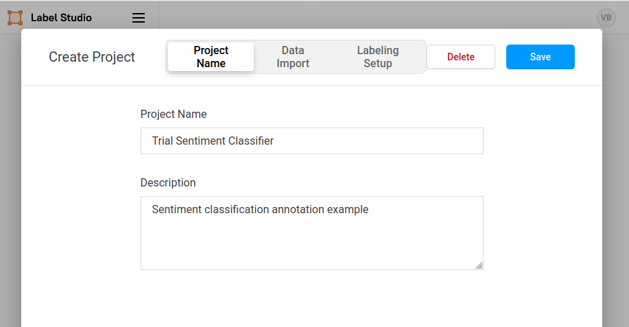
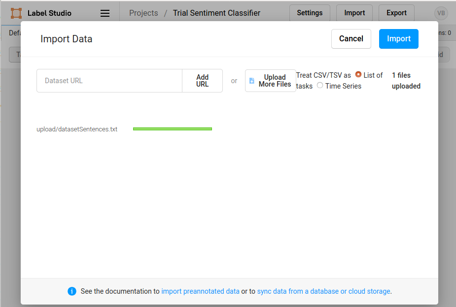
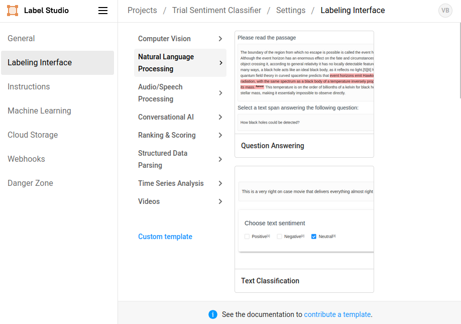
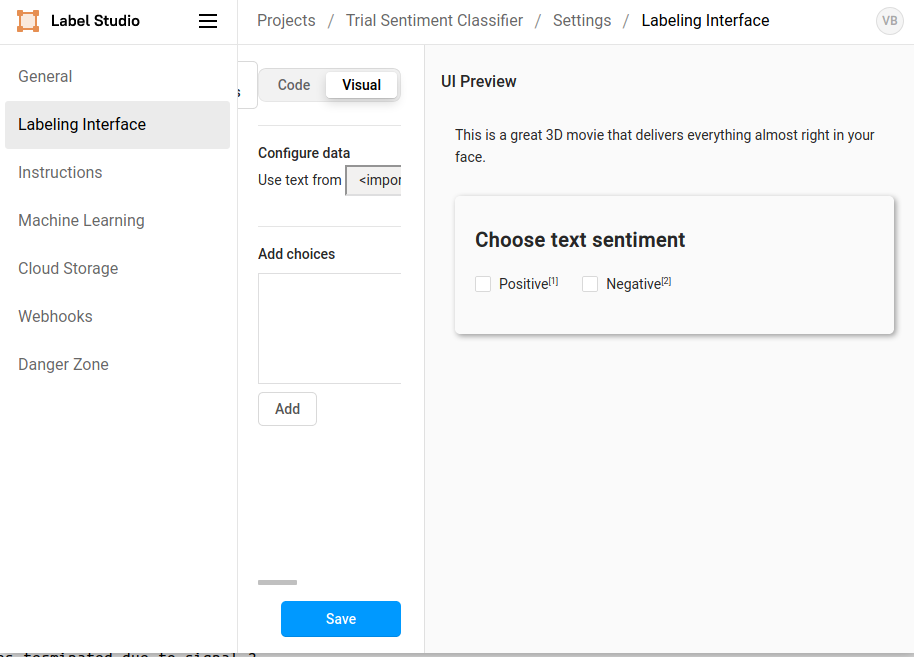
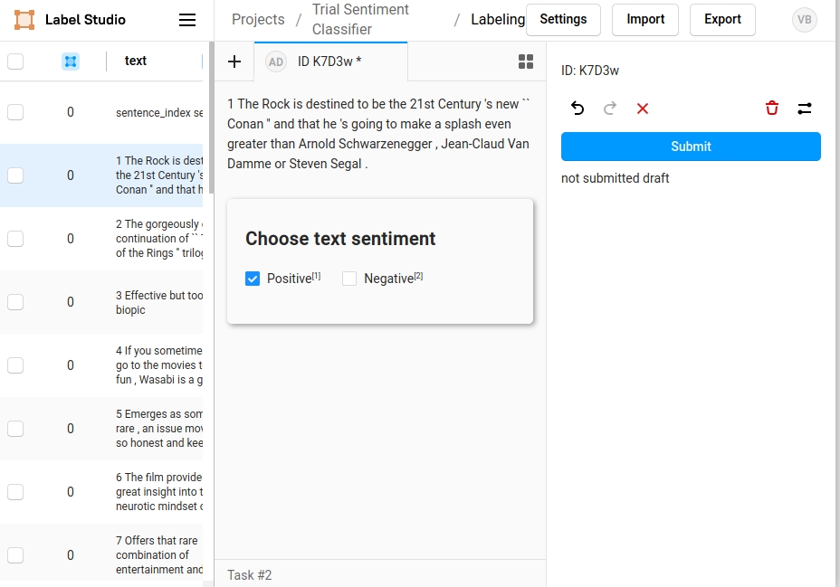
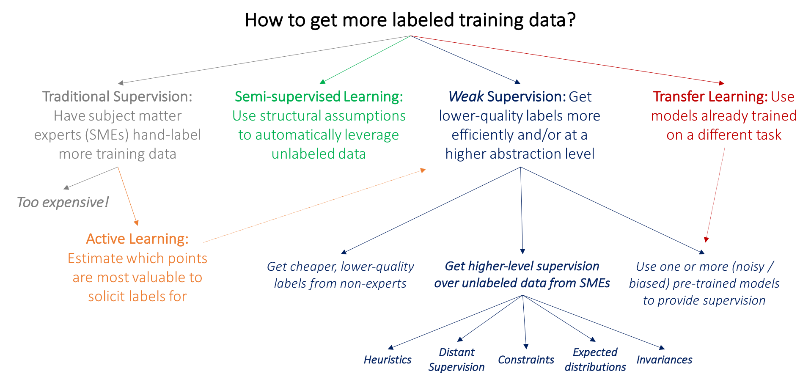
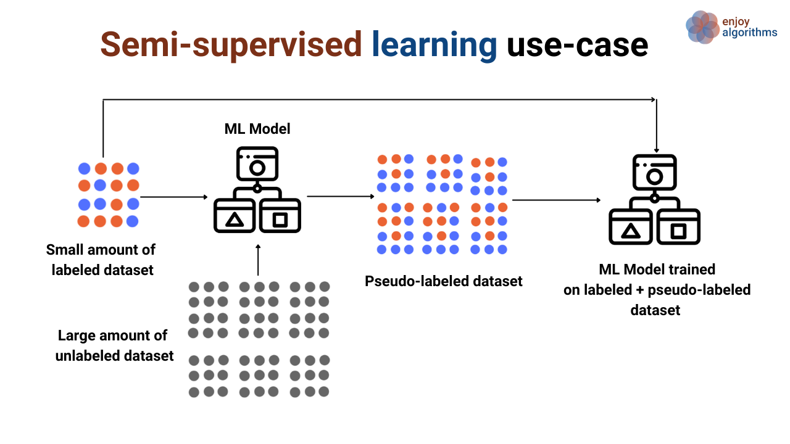
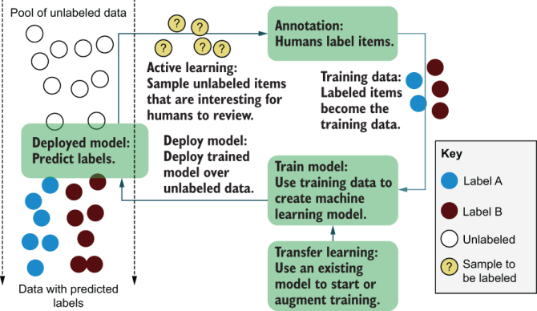
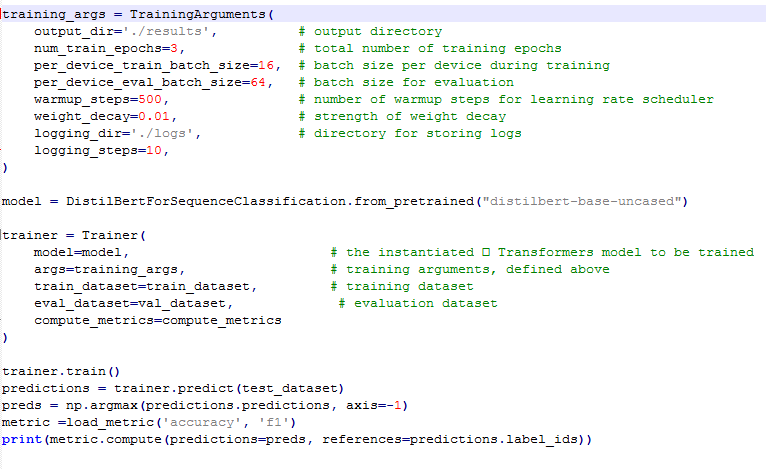

NLP without a readymade labeled dataset
========================================================
author: Sowmya Vajjala
date: 15th November 2021
autosize: true
navigation: section

workshop @ Toronto Machine Learning Summit, 2021


<style>
.small-code pre code {
  font-size: 1em;
}
</style>

Tutorial Overview
========================================================
- NLP: Overview
- Collecting and Labeling data
- Increasing labeled data: data augmentation
- Modeling with small datasets - a few scenarios
  - Automatically labeling data: weak supervision
  - Transfer Learning
- A case study (with code examples)
- Conclusion

Code, slides: [https://github.com/nishkalavallabhi/TMLS2021-Tutorial/](https://github.com/nishkalavallabhi/TMLS2021-Tutorial/)
  
About Me
========================================================
- Researcher at National Research Council, Canada
- Past experiences: Industry, Academic Research, Teaching, Mentoring etc. 
- Co-authored a book recently: "Practical Natural Language Processing - A Comprehensive Guide to Building Real-World NLP Systems"

About You
========================================================
- You know something about NLP
- You perhaps already faced this issue with labeled datasets
- You don't already know everything about addressing this issue :-)

NLP: An Overview
========================================================
type: section


========================================================
 


Some common NLP use cases
========================================================
 

source: [2020 NLP survey](https://gradientflow.com/2020nlpsurvey/)


NLP System Development Pipeline
========================================================
 

source: Chapter 2 in practicalnlp.ai


Data and NLP
========================================================
  - The starting point of any modern NLP system is data. 
  - However, we often don't have ready made datasets that suit our need. 
  - What should we do, then? 
     - Why do we need data, anyway?
     - What kind of data do we really need for NLP? 
     - how do we collect such data?

So, why do we need data, anyway?
========================================================
incremental: true

- Modern NLP is heavily machine learning driven and machine learning approaches typically require lots and lots of examples to "train" on and learn a task.
  
- Assuming we are "engineering" everything manually, we still need some kind of curated data to evaluate our approach for its accuracy and coverage.
  
- Even if we are just using some off-the-shelf solution, we need to know how good it is for our scenario!
 
- So, good quality datasets are very (very) important for building any NLP system. 

What kind of data do we really need for NLP? - 1
========================================================
- Different kinds of NLP systems need different kinds of data. 

- Sometimes, all we need are large collections of documents without any additional information e.g.,

  - building large pre-trained language models (e.g., BERT)
  - topic models
  - clustering
  

What kind of data do we really need for NLP? - 2
========================================================
But in many cases, we need large collections of labeled data i.e., source -> target pairs. e.g.,

    - sentence-translated sentence pairs (machine translation)
    - spam/non-spam emails (an example text classification)
    - question-answer pairs
    - sentence -> names of entities in it, relations between them etc (information extraction)


What kind of data do we need? - 3
========================================================
   - Quantity: Typically, "learning" methods are data hungry. The more, the better, although it may plateau at some point. (What is large?)
   
    - Quality: Garbage in -> Garbage out. We can't take **anything** we can lay hands on. (Why?) 
   
    - Data without ethics and privacy concerns such as using data without consent, keeping personally identifiable information, racial/gender bias in training examples etc. (Why is this important?)
   
    - Variety: e.g., legal domain docs for legal use cases) (Why?) 


Typical "no data to start with" scenarios
========================================================
- a very company specific NLP problem (e.g., routing customer tickets automatically to different departments)
- a common NLP problem, but for a specific domain (e.g., financial sentiment analysis)
- building a common NLP system, but for a new language (e.g., a named entity recognizer for, say, French)
- building a common NLP system, for a new, low resource language (e.g., machine translation for English to Ojibwe language)

etc.  

Collecting and Labeling datasets
========================================================
type: section
    
How do we obtain labeled data? - 1
========================================================
incremental: true

  - use available data sets with some labeling, if they suit your need:
      - scraping websites (forums, wikipedia, news etc)
      - social media content (tweets etc)
      - internal data (logs, customer support messages etc)
  - advantages:  
        - We don't have to setup new labeling mechanisms  
        - potentially large amounts of data can be collected
  - disadvantage: quality control?
  - Note that this is not your most common scenario in real world
      
How do we obtain labeled data? - 2
========================================================

collect your own data: surveys, user studies, crowd sourcing etc. 
   

(source: [Doccano](https://github.com/doccano/doccano))

- Advantage: We can collect data suited to our requirements

- Disadvantage: It can be very expensive/time consuming to get large amounts needed for ML/DL models. 

Annotating our own data: Label studio
========================================================


Label studio-Example
========================================================


Label studio-Example
========================================================


Label studio-setting things up
========================================================


Label studio - export the labeled dataset
========================================================


Label Studio - input and output
========================================================


Labeling data - conclusion
========================================================
- I just showed a simple example, but there are a whole lot of annotation support tools for NLP tasks.
- [This listing by Doccano](https://github.com/doccano/awesome-annotation-tools) provides a comparison in terms of features, pricing, and the kind of NLP tasks that the tools support. 

Increasing labeled data: Data Augmentation
========================================================
type: section

Why? How small is a small dataset?
========================================================
   - depends on the task, language etc.
   - sometimes, 1000 labeled examples is a lot. 
   - sometimes, 50K labeled examples is not that much.
   - for tasks like language modeling (read: GPT-3 and so on), no amount of data is "a lot", it looks like.

Data Augmentation 
========================================================
Generate new data by slightly modifying existing (labeled) data.

Some ways of doing this:
- Replacing words with synonyms
- Back translation 
- Random insertion/deletion of words
- Swapping words
- Simulated typos/OCR errors etc. 
etc.

Some python libraries: [nlpaug](https://github.com/makcedward/nlpaug), [eda_nlp](https://github.com/jasonwei20/eda_nlp), [snorkel](https://snorkel.org)

Data Augmentation: Example 1
========================================================
Replacing words with synonyms (of different kinds) 


source: [https://github.com/makcedward/nlpaug](nlpaug)


Data Augmentation: Example 2 
========================================================
Back translation


[https://amitness.com/2020/05/data-augmentation-for-nlp/](Source)

<!-- may be add some code examples here? --> 

Data Augmentation: Conclusion
========================================================

- Data augmentation has been shown to be useful in a range of NLP tasks such as text classification, machine translation, question answering etc.

- It is commonly used in real-world scenarios (based on what I hear from others in the community!)

- [Data augmentation techniques for NLP](https://github.com/styfeng/DataAug4NLP) - survey with lot of references

- Some code examples: [nlpaug examples](https://github.com/makcedward/nlpaug/blob/master/example/textual_augmenter.ipynb)

- A data augmentation tutorial from [Snorkel](https://www.snorkel.org/use-cases/02-spam-data-augmentation-tutorial)

Modeling with small datasets
========================================================
type: section
    

Modeling with small(-er) datasets
========================================================
Even data augmentation may not be enough to make a "large" dataset, sometimes.

[from stanford AI blog](http://ai.stanford.edu/blog/weak-supervision)





Weak supervision: an introduction
========================================================
incremental:true

Generally, most 'learning' methods used in NLP are data hungry. However, it is time consuming and also expensive to hand label so much of data for each new problem. 

Sometimes, we may have to update existing labels to suit changed guidelines or just update the dataset etc. (not so uncommon in real world). How do we handle the costs/time taken? 

"Weak supervision" refers to a machine learning approach which relies on "imprecise" training data, which is potentially "generated" automatically. 


"Practical" Weak Supervision -1
========================================================


[source - skweak Python library](https://github.com/NorskRegnesentral/skweak)

"Practical" Weak Supervision -2
========================================================


[Source](https://db.cs.washington.edu/events/workshop/2019/slides/alex-ratner.pdf)

How can this work in practice: Snorkel
========================================================


[Source](https://db.cs.washington.edu/events/workshop/2019/slides/alex-ratner.pdf)


How do we write the labeling functions?
========================================================
incremental: true

- pattern matching
   - regular expressions
   - list of words or phrases
   - ordered patterns (e.g., X followed by Y)
   
- A good labeling function should:
  - realistically cover several examples in the dataset (at least 10%)
  - have has high precision and good coverage.
  
(Some ideas by dataqa team - https://dataqa.ai/docs/rule_guide/classification_guide/)
  
How are such rules useful?
========================================================
incremental: true

- We can create some "noisy" labeled data with rules.
- We can use rules with imbalanced data, to increase labeled examples of a rare class.
- if your data changes, or labeling guidelines changes, you can still use some of the previous rules without having to start from scratch.
- Your rule based system is perhaps easily explainable. So, if it works with a decent precision, it can be a strong baseline. 


Sounds good! Does it really work, though?
========================================================


Sounds good! Does it really work, though?
========================================================


source: https://www.snorkel.org/resources/


Other methods: Active Learning
========================================================


[source: Professor Tom Mitchell's course slides](https://www.cs.cmu.edu/~tom/10701_sp11/recitations/Recitation_13.pdf)

Other methods: Semi-supervised Learning
========================================================

[source](https://www.enjoyalgorithms.com/blogs/supervised-unsupervised-and-semisupervised-learning)

Other methods: Transfer Learning
========================================================

[source - ruder.io](https://ruder.io/transfer-learning/). 

Note: Transfer can also be cross-lingual. 

A scenario combining them all
========================================================


source: Chapter 1 in ["Human-in-the-Loop Machine Learning " by Robert Munro.] (https://www.manning.com/books/human-in-the-loop-machine-learning)

Practical Advice-1
========================================================
incremental: true

Let us say you have no data to start with. What is the way forward?

- Understand your requirements, and create a small, high-quality, manually inspected, labeled dataset (e.g., using label studio like tools)
- Evaluate an off-the shelf solution if it exists (e.g., a cloud service provider)
- Create automatically labeled data and build a model using weak supervision, evaluating with your high quality test data.

Practical Advice-2
========================================================
incremental: true

You managed to get some labeled data through automatic labeling or other means.

You also managed a baseline weakly supervised model. 

Then, what?

- Evaluate transfer learning if a similar model is available
- Consider if Semi-supervised learning and/or Active learning will be useful

Slowly, you built up a large collection of labeled or pseudo-labeled data:
- Explore more sophisticated ML/DL models

A case study
========================================================
type: section

The Problem
========================================================
incremental: true

- **Problem:** Sentiment classification of sentences into positive and negative
- **Nature of the dataset:** Labeled. I will use it as if a part of it were unlabeled, in some of the examples that follow. 
- **why did I choose such a common problem?**
    - it is common, so we will find some ready made solutions to compare with automatic labeling
    - it is common, but the dataset I chose makes it slightly difficult to use off the shelf solutions. 
    
The Dataset
========================================================
[Sentiment Labelled Sentences Dataset](http://archive.ics.uci.edu/ml/datasets/Sentiment+Labelled+Sentences) from UCI repository.

- sentences with one of the two labels: 1 (positive), 0 (negative)

- The sentences come from three websites: amazon, imdb, yelp.

- For each website, there are 500 sentences per category.

- I will use the amazon part (500+500 - 1000 labeled examples) as my test data everywhere.  

(in real world, you may have to create such a dataset using tools like label studio/doccano etc, or if you are lucky, you already have internal labeled data)

Methods: Modeling
========================================================
No labeled data scenario (with just labeled test data)  
  - using a cloud service provider's sentiment analyzer
  - using an off the shelf Python library (free)  
  
  - using weak supervision (unlabeled train + labeled test data)

Comparing with labeled data scenario 
(labeled train + labeled test)
- train your sentiment classifier from scratch
- transfer learning: use an existing pre-trained language model and **tune** it using your training data

Methods: Feature representation
========================================================

(for weak supervision model, and when we build other classifiers with labeled data)
   - bag of words
   - sentence transformers (sbert.net)
   
Why? - to illustrate one simple text representation, one state of the art neural text representation.

No data NLP: using off the shelf solutions
========================================================
type: section

Sentiment Analysis with Azure Text Analytics
========================================================

[source](https://docs.microsoft.com/en-us/azure/cognitive-services/text-analytics/how-tos/text-analytics-how-to-sentiment-analysis?tabs=version-3-1)

- "Sentiment Analysis in version 3.x applies sentiment labels to text, which are returned at a sentence and document level, with a confidence score for each."

- labels: positive, negative, mixed, neutral

- "Confidence scores range from 1 to 0. Scores closer to 1 indicate a higher confidence in the label's classification, while lower scores indicate lower confidence."

Sentiment Analysis with Azure Text Analytics
========================================================
Things to think about: 
- We need a model with only positive/negative labels. What should we do about mixed/neutral? 
- Is this a permanent solution, or should we start thinking about collecting labeled data eventually?

Sentiment Analysis with Azure Text Analytics
========================================================


(code/CloudServiceExample.ipynb)

Sentiment Analysis with Azure Text Analytics
========================================================


(About 100 instances from my test set are labeled either "netural" or "mixed" as per Azure.)


Sentiment Analysis with TextBlob
========================================================


(code/textblobsentiment.py)


No Data NLP - Conclusion
========================================================

We get a good start: over 80% accuracy with Azure

Pros: You don't have to worry about setting stuff up, building and maintaining the sentiment analyzer etc. You can quickly get an MVP up and running.

Cons:
- This only works if you have problem that exactly meets the specifications of such an available API
- No possibility of customization/modification, we don't know what it is doing.
- Depending on how much you use, costs may escalate
- Will this be a long term solution for your problem?


Weak supervision, with Snorkel
========================================================

Note: I am using "unlabeled" training data to programmatically create labels for it

How?: 
- Write a few labeling functions based on heuristics (I wrote using existing lists of positive/negative words)
- learn a label model, from the output of such labeling functions (Snorkel's learner)
- convert learnt label distribution into training data ready to be used by any ML/DL approach. 


Labeling functions with Snorkel
========================================================


(where the poswords/negwords came from a standard list)


Labeling functions with Snorkel: How good are they
========================================================


- Coverage: The fraction of the dataset the LF labels
- Overlaps: The fraction of the dataset where this LF and at least one other LF label
- Conflicts: The fraction of the dataset where this LF and at least one other LF label and disagree

(Clearly, these are not sufficient/good enough LFs, but I am still going ahead, as I am using this only as an illustration!)

How many labeling functions?
========================================================

- as many as you can, such that:
- no two functions overlap too much
- together they should achieve maximum coverage of the unlabeled examples. 

Learning a label model
========================================================

Step 1: Convert your (unlabeled) train and (labeled) test into the feature representation based on these LFs.

```python
applier = PandasLFApplier(lfs=lfs)
L_train = applier.apply(df=df_train)
L_test = applier.apply(df=df_test)
```

Learning a label model
========================================================
Step 2: Our goal is now to convert the labels from our LFs into a single noise-aware probabilistic (or confidence-weighted) label per data point. 

- An easy way: majority vote on a per-data point basis: if more LFs voted POS than NEG for a data point, label it POS (and vice versa)

- Snorkel also has a more advanced label model, to learn such confidence weighted label represnetations, though.

Learning a label model
========================================================


Since my LFs are not that good (and too few?), we don't see much difference between MajorityLabel or LabelModel, with the former being slightly better. 

So, why can't we just use this as the final labeling model?? 

From label model to training data
========================================================

- If we use this approach, the data points the model will "ABSTAIN" from labeling some data points. What do we do with them?

- Instead, we will use the outputs of the LabelModel as training labels to train a classifier which can generalize beyond the labeling function outputs.

From label model to training data
========================================================
Step 1: Filter out the unlabeled data points:

```python
from snorkel.labeling import filter_unlabeled_dataframe

df_train_filtered, probs_train_filtered = filter_unlabeled_dataframe(
    X=df_train, y=probs_train, L=L_train
)

from snorkel.utils import probs_to_preds
preds_train_filtered = probs_to_preds(probs=probs_train_filtered)
```

Sentiment classification with this "generated" training data
========================================================
<table cellspacing="0" cellpadding="0">
<tr><td>With Bag of words features</td>
<td></td>
</tr>
<tr><td>with features from a transformer model</td>
<td></td>
</tr>
</table>
**(We managed to get to 73% without an actual labeled training dataset!)**

Pros and Cons
========================================================
incremental:true

Pros:
- Quick way to generate (labeled) training data programmatically. 
- Tried and tested, used in many industry usecases for NLP.
- Useful to build a first solution quickly. (73% is not a bad start without data!)

Cons:
- We have to develop the labeled functions, and it won't be easy unless we have clear knowledge about the problem.
- This may not work very well for all kinds of NLP problems. 

What if I just have my labeled training set?
========================================================
How do these approaches compare to a more optimistic scenario where I actually have some labeled training data??

We can do two things in this case: 
- train our own classifier with our training data
- fine-tune a large language model using our training data

(and test with the same test set as before!)

Training your own classifier -1 (with bag of words)
========================================================


(code/withLabeledTrainingData.ipynb)


Training our own classifier-2 (with sbert)
========================================================


(code/withLabeledTrainingData.ipynb)

Transfer learning with our dataset
========================================================
incremental: true

- intuition: When I used sbert features earlier, I just used the representations a large language model learnt (using some large data set, on some tasks) **"as is"**.

- The goal of fine-tuning is to take this large language model as its base, and "re-train" it to suit our classification task, using our training data. 

- The pre-trained model's weights are then altered ("fine-tuned") while training for the task

- while all this may sound complex, there are easy to use implementations of transfer learning for many NLP tasks. 

Transfer learning with our dataset
========================================================


**This gave me 92.7% accuracy on the test set!**   
(code/finetune-sentiment.py)

Pros and Cons of training our own models
========================================================

Pros:
- We have control over the modeling process.
- We may get better performance, as this is a custom made model for us. 

Cons:
- We need large enough labeled training sets as a starting point. 
- We also need more knowledge and expertise, and know what to experiment and what to discard. 

Summary of all approaches
========================================================
<b>When we have don't have labeled training data</b>
(but have labeled test set)
<table>
<tr>
<td><b>Approach</b></td>
<td><b>Accuracy</b></td>
</tr>
<tr>
<td>predictions from Azure</td>
<td>84%</td>
</tr>
<tr>
<td>predictions from TextBlob</td>
<td>69%</td>
</tr>
<td>Weak supervision with Snorkel (with sentence transformers)</td>
<td>73%</td>
</tr>
</table>

<b>When we have some amount of labeled training data (and with the same test set)</b>
<table>
<tr>
<td><b>Approach</b></td>
<td><b>Accuracy</b></td>
</tr>
<tr>
<td>Training our own model (with bag of words features)</td>
<td>74%</td>
</tr>
<tr>
<td>Training our own model (with sentence transformers)</td>
<td>88%</td>
</tr>
<tr>
<td>Transfer learning</td>
<td><b>92.7%</b></td>
</tr>
</table>
(Note: We can use data augmentation in scenarios from both tables, I leave it as an exercise!)

Caveats on the approach I took
========================================================
incremental: true

- I only want to show a range of methods to apply when you encounter a "no labeled data" scenario.

- so i took a relatively easy example

- this is by no means a statement that azure works or transfer learning works.

- with careful heuristics, even weak supervision may give you much better performance than what you saw in this example!

A summary of what we discussed so far
========================================================

- different means of collecting data for NLP
- manual labeling to compile a high quality test dataset
- using off the shelf solutions, if available, and evaluating them
- using weak supervision, to build a labeled dataset automatically, and then training a ML/DL model
- how this compares with the case when we have some labeled dataset (regular classification, transfer learning)
- an overview of other methods: (semi-supervised, active learning)

There are a lot of things I don't talk about!
========================================================

- feature engineering, text representation
- models, evaluation, comparisons
- testing models
- deploying and monitoring NLP systems
- updating models

etc
etc

Revisiting: Practical Advice-1 
========================================================
incremental: true

Let us say you have no data to start with. What is the way forward?

- Understand your requirements, and create a small, high-quality, manually inspected, labeled dataset (e.g., using label studio like tools)
- Evaluate an off-the shelf solution if it exists (e.g., a cloud service provider)
- Create automatically labeled data and build a model using weak supervision, evaluating with your high quality test data.

Revisiting: Practical Advice-2
========================================================
incremental: true

You managed to get some labeled data through automatic labeling or other means.

You also managed a baseline weakly supervised model. 

Then, what?

- Evaluate transfer learning if a similar model is available
- Consider if Semi-supervised learning and/or Active learning will be useful

Slowly, you built up a large collection of labeled or pseudo-labeled data:
- Explore more sophisticated ML/DL models


Thank you!
========================================================

I hope this tutorial gave you some overview of what to do when you encounter a new NLP task, without labeled data!

my contact: firstname.lastname at nrc-cnrc dot gc dot ca

Some useful references
========================================================
- [Eugene Yan's blog post on bootstrapping labeled data](https://eugeneyan.com/writing/bootstrapping-data-labels/)
- [transfer learning lesson from huggingface]( https://huggingface.co/course/chapter3?fw=pt)
- ["A Survey on Recent Approaches for Natural Language Processing in
Low-Resource Scenarios"](https://aclanthology.org/2021.naacl-main.201.pdf)
